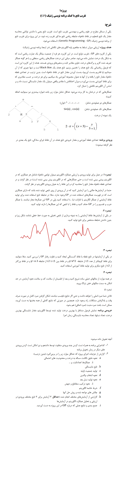

# **🧬 Genetic Programming: Function Approximation Project | پروژه برنامه‌نویسی ژنتیک: تقریب تابع**

**In this university project, genetic programming is used to approximate the function.**

**در این پروژه دانشگاهی برای تقریب تابع از برنامه‌نویسی ژنتیک استفاده می‌شود.**

# 💬 **نکات پروژه**

* گزارش و عکس‌های برنامه در دایرکتوری Report قرار دارند.
* برای اجرا برنامه، به پایتون بالاتر از نسخه 3.6 نیاز دارید.
* کتابخانه‌های مورد نیاز در فایل requirements.txt قرار دارند.
* برای دسترسی به همه‌ی پروژه‌های دانشگاهی من، به این لینک مراجعه کنید:

👈🏻 **[پروژه‌های دانشگاهی من](https://github.com/bestmahdi2/Uni__Bachelors_SKU_Path)**

# 📝 **توضیحات پروژه**

